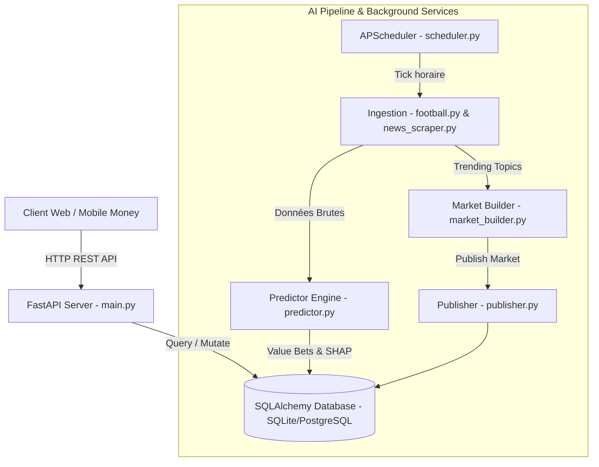

# Document de Conception Technique (Engineering Design Doc) : Architecture PredicAfrika

## 1. Présentation Technique Exécutive
**PredicAfrika** est une plateforme hybride combinant un front-end Web réactif PWA (Zero-Framework / Vanilla JavaScript ES6+, HTML5, CSS Custom Properties) et un moteur d'IA asynchrone hautement modulaire basé sur **FastAPI**, **SQLAlchemy** et **APScheduler**.

Le système assure l'ingestion automatique de données sportives et d'actualités, l'exécution de modèles prédictifs Machine Learning (RandomForest/XGBoost avec détection de Value Bets et explication SHAP), et la génération autonome de marchés d'opinion d'actualité. Les données sont servies via des API REST sécurisées et consommées côté client avec gestion du Mobile Money multi-pays et support bilingue (FR/EN).

---

## 2. Architecture Système & Stack Technique

### 2.1 Matrice Technique
* **Frontend Web** : JavaScript Vanilla (ES6+), HTML5 Semantic, Vanilla CSS3 (Design Tokens & Variables), Système I18n JSON/DOM.
* **Backend API & IA** : Python 3.10+, FastAPI (Port 8000), Uvicorn ASGI Server.
* **ORM & Base de Données** : SQLAlchemy 2.0. SQLite (`predicafrika.db`) pour l'environnement de développement local, prêt pour migration PostgreSQL en production.
* **Planificateur de Tâches** : `APScheduler` (AsyncIOScheduler) intégré au cycle de vie (lifespan) de l'application FastAPI.
* **Moteur ML & Ingestion** : Scikit-Learn, SHAP, BeautifulSoup4 / Requests pour le scraping d'actualités, et connecteurs API REST (API-Football, Sportmonks).

---

## 3. Schéma de Base de Données & Modèles ORM

Le schéma de données est défini dans [`ai_pipeline/database/models.py`](file:///Users/a2020/Desktop/METATEK/predicafrika/ai_pipeline/database/models.py) :

### 3.1 Entité `Match` (`matches`)
* `id`: Integer (Primary Key)
* `domain`: String (ex. `"football"`, `"basketball"`, `"crypto"`)
* `home_team`: String
* `away_team`: String
* `match_date`: DateTime
* `status`: String (`"upcoming"`, `"finished"`, `"live"`)
* `home_odds`, `draw_odds`, `away_odds`: Float (Cotes proposées par les bookmakers)
* `home_score`, `away_score`: Integer (Résultats finaux)

### 3.2 Entité `Prediction` (`predictions`)
* `id`: Integer (Primary Key)
* `match_id`: Integer (Foreign Key vers `matches.id`)
* `created_at`: DateTime
* `predicted_winner`: String (`"home"`, `"away"`, `"draw"`)
* `confidence`: Float (Probabilité estimée par le modèle ML, ex: `0.75`)
* `is_value_bet`: Boolean (Calculé si $\text{confidence} > \text{implied\_prob} \times 1.10$)
* `explanation`: String (Texte d'explicabilité XAI SHAP)

### 3.3 Entité `GenericMarket` (`generic_markets`)
* `id`: Integer (Primary Key)
* `title`: String
* `description`: String
* `category`: String (`"politics"`, `"crypto"`, `"entertainment"`, `"economy"`)
* `options_json`: String (JSON sérialisé, ex: `'["Oui", "Non"]'`)
* `odds_json`: String (JSON sérialisé, ex: `'[1.85, 2.10]'`)
* `expiry_date`: DateTime
* `status`: String (`"active"`, `"resolved"`, `"cancelled"`)
* `total_pool`: Float (Montant cumulé des mises en XOF)

---

## 4. Spécifications des Endpoints REST API

### `GET /api/predictions`
* **Query Parameters** : `domain` (optionnel)
* **Description** : Jointure entre `matches` et `predictions` pour retourner les 10 prochains matchs avec prédiction et indicateurs Value Bet.

### `GET /api/markets`
* **Query Parameters** : `domain` (optionnel)
* **Description** : Retourne les marchés génériques actifs d'opinions et de tendances.

### `POST /api/markets/generate`
* **Description** : Déclenche manuellement le scraper de tendances (`news_scraper.py`), la construction de marché (`market_builder.py`) et la publication dans la base de données (`publisher.py`).

---

## 5. Stratégie de Test (Testing Strategy)

### 5.1 Tests Unitaires (Fonctions Utilitaires & Moteur IA)
* **`generate_predictions(db)`** dans [`predictor.py`](file:///Users/a2020/Desktop/METATEK/predicafrika/ai_pipeline/models/predictor.py) :
  * *Vérification* : Valider que le calcul de `is_value_bet` retourne `True` si et seulement si la confiance du modèle dépasse de plus de 10% la probabilité implicite ($1 / \text{cote}$).
  * *Vérification* : Valider qu'une prédiction est générée uniquement pour les matchs qui ne possèdent pas encore d'entrée dans la table `predictions`.
* **`build_market_from_topic(topic)`** dans [`market_builder.py`](file:///Users/a2020/Desktop/METATEK/predicafrika/ai_pipeline/market_generator/market_builder.py) :
  * *Vérification* : S'assurer que la structure de données renvoyée contient un titre non vide, des options sous forme de liste JSON valide et des cotes initiales cohérentes ($\ge 1.05$).
* **`publish_market(db, market_data)`** dans [`publisher.py`](file:///Users/a2020/Desktop/METATEK/predicafrika/ai_pipeline/market_generator/publisher.py) :
  * *Vérification* : Vérifier la bonne persistance de l'objet `GenericMarket` en base de données SQLite avec la conversion correcte des listes Python en chaînes JSON.
* **Formatage Financier & Calcul de Gains Client** dans [`app.js`](file:///Users/a2020/Desktop/METATEK/predicafrika/app.js) :
  * *Vérification* : Tester le calcul du rendement potentiel $\text{Gain} = \text{Mise} \times \text{Cote}$ et la conversion de devises selon le pays sélectionné.

### 5.2 Tests d'Intégration (Couverture des Flux Majeurs)

1. **Flux 1 : Ingestion Automatique -> Inférence IA -> Exposition API (`GET /api/predictions`)**
   * *Action* : Insertion d'un match de test ("Sénégal" vs "Côte d'Ivoire") sans prédiction, puis déclenchement de `generate_predictions(db)`.
   * *Assertion* : Effectuer un appel `GET /api/predictions?domain=football` via le client de test FastAPI (`TestClient`). Vérifier que la réponse HTTP est `200 OK`, que le tableau de données contient la rencontre et que les clés `is_value_bet` et `explanation` sont correctement renseignées.

2. **Flux 2 : Génération de Marchés de Tendances via API (`POST /api/markets/generate`)**
   * *Action* : Envoi d'une requête `POST /api/markets/generate` avec mocking du scraper de news.
   * *Assertion* : S'assurer que le status de réponse est `"success"`, vérifier la création de nouveaux enregistrements dans la table `generic_markets` et valider qu'un appel subséquent à `GET /api/markets` retourne les nouveaux marchés créés.

3. **Flux 3 : Prise de Position P2P & Intégration Mobile Money Client**
   * *Action* : Sélection d'un marché d'opinion sur l'interface PWA, saisie d'un montant de mise (5 000 XOF), sélection d'un numéro Wave/Orange Money et confirmation de l'ordre.
   * *Assertion* : Vérifier la mise à jour dynamique du solde du portefeuille virtuel, l'augmentation du `total_pool` du marché concerné et le rendu immédiat de la confirmation d'ordre dans l'interface.

### 5.3 Ce qui n'est DÉLIBÉRÉMENT PAS testé (Out of Scope for Automated Tests)
* **Réseaux réels d'API Mobile Money en Production** : Les requêtes d'exécution financières directes vers les passerelles d'API réelles Orange Money / Wave en environnement de test (mockés via des réponses de simulation).
* **Scraping réseau en direct sans Fixtures** : Le scraping dynamique de sites d'actualités externes sans serveur de stub (pour éviter les échecs de build dus à des changements de structure HTML tiers ou des blocages d'IP).
* **Effets visuels CSS & Animations Canvas/SVG** : La fidélité exacte des rendus visuels des gradients et animations radar CSS sur navigateur mobile réel (validée par inspection visuelle).
